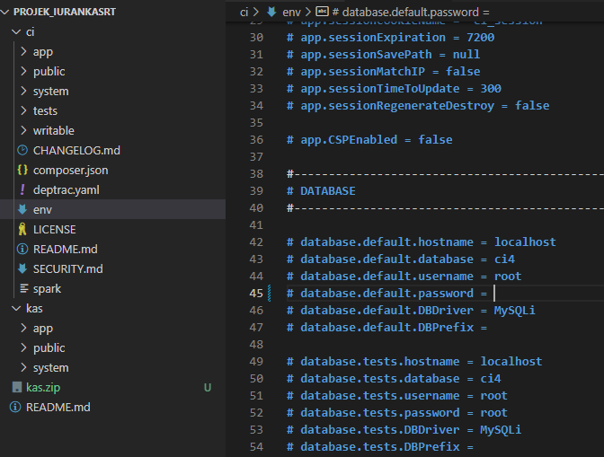
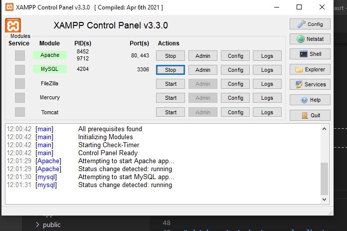

# Projek_Iurankasrt
untuk memenuhi UAS Pemogramman web

Nama        : Antini permatasari 
NIM         : 312010095 
kelas       : TI.20.B.1 
SOAL UAS    : Membuat Aplikasi Pengolahan Iuran KAS RT 

# 1.Membuat Database
# 2.Konfigurasi koneksi database & Membuat Program php

  # 3.XAMPP Control Panel

# 3.Menjalankan CLI (Command Line Interface)
  
  
  **TERIMAKASIH**

